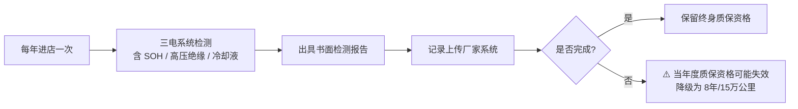

# 比亚迪 BYD

> 本文档为 car-maintenance-advisor skill 的品牌分项参考，数据来自公开车主手册摘要与行业共识，最后更新 2026-08

## 品牌保养规格总览

> 比亚迪产品线覆盖纯电（e 系列 / 海洋网 EV）、插电混动（DM-i / DM-p）与少量燃油。下表以「混动 DM-i/DM-p」与「纯电 EV」对照；燃油车型参考混动列并增加火花塞、燃油滤芯等项目。

| 项目 | 混动（DM-i / DM-p） | 纯电（EV） |
|------|---------------------|-----------|
| 机油 + 机滤 | 7,500 km 或 6 月（全合成可延至 10,000 km） | — |
| 空气滤芯 | 15,000 km | 15,000 km |
| 空调滤芯 | 15,000 km | 15,000 km |
| 火花塞 | 30,000 km（镍合金） | 不适用 |
| 减速箱油（电驱） | 40,000 km | 40,000 km |
| 刹车油 | 2 年 或 30,000 km | 2 年 |
| 冷却液（发动机） | 视手册，一般 60,000 km 或 4 年 | — |
| 冷却液（三电/电池） | 首次 20,000 km，之后每 20,000 km | 首次 20,000 km，之后每 20,000 km |
| 空调冷媒 | 2 年检查 | 2 年检查 |
| 轮胎换位 | 每 20,000 km | ⚠️ 电车扭矩大且车重，建议每 10,000 km 换位 |
| 电池健康检测（SOH） | 每 12 个月进店 | 每 12 个月进店 |
| 12V 蓄电池 | 2 年检查 | 2 年检查 |
| 高压线束绝缘检测 | 每 12 个月 | 每 12 个月 |

> ⚠️ **比亚迪特别提醒：** 三电系统质保与「年度进店检测」强绑定。若任一年度未在授权服务店完成 SOH 检测并上传记录，三电终身质保资格将受影响。务必保留每年度检测单据。

## 机油与油液规格

| 油液类型 | 厂方规格要求 | 推荐粘度 | 备注 |
|---------|-------------|---------|------|
| 机油（混动） | 比亚迪自有规格，兼容 API SP / ILSAC GF-6 | 5W-30（主流混动车型） | DM-i 高频启停，建议全合成 |
| 机油（燃油） | 同上 | 5W-30 / 5W-40 | 视车型 |
| 刹车油 | DOT 4 | — | ⚠️ 不可用 DOT 5（硅油类） |
| 冷却液（发动机） | 比亚迪专用乙二醇型，红色 | — | 免混，补液须同色同型号 |
| 冷却液（电池） | 比亚迪低电导率电池冷却液，蓝绿色 | — | ⚠️ 不可用发动机防冻液代替 |
| 减速箱油（电驱） | 比亚迪电驱专用减速箱油 | — | 40,000 km 更换；与变速箱油不通用 |
| 空调冷媒 | R134a（部分新款 R1234yf） | — | 需认证技师操作 |
| 制动液含水率 | < 3% 为安全 | — | 检测笔可自测 |

## 常见通病速查

| 高发问题 | 早期征兆 | 级别 | 是否延保 / 召回 |
|---------|---------|------|----------------|
| DM-i 启动轴抖动 / 起步抖 | 低速纯电切混动时方向盘及座椅抖动，冷车更明显 | 中 | 部分批次延长启动轴质保；个别车型召回更新程序 |
| EV 限制 / 动力受限 | 仪表弹「EV 功能受限」，加速无力 | 高 | 三电质保范围内免费检修；多为 BMS 或电机控制器故障 |
| 动力电池 SOC 跳变 | 电量显示突然跳 10% 以上，或充满只到 95% | 中 | 软件升级 + SOH 校准；严重衰减可索赔 |
| 高压互锁故障 | 无法上高压，仪表报互锁异常 | 高 | 质保内免费更换线束连接器 |
| 空调压缩机异响 | 开空调后前舱「嗡嗡」低频噪音 | 低 | 个别批次更换压缩机 |
| 12V 蓄电池早衰 | 远程启动失败、中控黑屏重启 | 低 | 部分车型升级 DC-DC 管理策略 |
| 充电跳枪 / 慢充中断 | 公共桩频繁跳枪，或慢充中途停止 | 中 | 充口温控或 BMS 策略问题，刷写升级 |

> 🔧 **通病处理原则：** 先查是否有对应 TSB（技术服务公告）或召回程序，再到授权店刷写最新 BMS / MCU 固件。多数「EV 受限」可通过软件升级解决，不必直接换件。

## 4S 常过度推销项

| 推销项 | 是否必要 | 建议间隔 | 自检法 |
|--------|---------|---------|--------|
| 发动机内部清洗（燃油/混动） | ❌ 一般不必要 | — | 机油无乳化、油底壳无油泥即无需 |
| 空调管路「杀菌除味」套餐 | ⚠️ 部分必要 | 2 年或异味出现时 | 闻空调出风口；有霉味再处理 |
| 节气门 / 进气道清洗（混动） | ⚠️ 视工况 | 40,000 km 或怠速抖动时 | 怠速稳定则不必 |
| 刹车深度保养（拆刹分泵润滑） | ❌ 常规不必 | — | 刹车无异响、不跑偏即可；雨季地区 2 年一次尚可 |
| 电池冷却液「升级」更换 | ⚠️ 按手册 | 首次 20,000 km，之后每 20,000 km | 查冷却液冰点与电导率 |
| 「三电深度检测」加价包 | ❌ 常规 SOH 检测已足够 | — | 要求出具标准 SOH 报告即可 |
| 轮胎「氮气填充」 | ❌ 不必要 | — | 普通压缩空气足够 |
| 玻璃水 / 空调滤芯加价换 | ⚠️ 比外面贵 | 按手册 | 空调滤芯可自行更换 |

## 新能源专属

> ⚠️ 比亚迪三电（电池、电机、电控）质保为本类文档重点。条款细则因车型与销售年份略有差异，以下为行业通行共识，**实际以购车合同及《三电终身质保条款》书面文本为准**。

### 三电质保条款细则

| 条款项 | 内容 |
|--------|------|
| 核心承诺 | 首任非营运车主三电系统终身质保（电芯终身，系统有年限/里程限制） |
| 跟车还是跟人 | **跟车不跟人**：过户后新车主享受 8 年 / 15 万公里三电质保，不再享受终身质保 |
| 终身质保前提 | ① 首任车主 ② 非营运 ③ 按厂家要求在授权店定期保养 ④ 每年至少进店做一次三电检测 ⑤ 单年行驶里程不超过限制（常见 30,000 km/年，视车型） ⑥ 无重大事故、火烧、水泡 ⑦ 未在非授权平台拆装三电 |
| 降级规则 | 任一条件不满足，终身质保降级为 8 年 / 15 万公里（部分车型 8 年 / 16 万公里） |
| 电芯 vs 包 | 「电芯终身质保」≠「电池包终身质保」。电芯外的 BMS、接插件、壳体、冷却板等按 8 年 / 15 万公里 |
| 营运车 | 营运车辆一律按 8 年 / 15 万公里，不享受终身质保 |

### SOH 检测与电池衰减索赔

| 项目 | 说明 |
|------|------|
| SOH 检测间隔 | 每 12 个月进店一次，与年度保养同步 |
| SOH 解读 | SOH ≥ 90% 健康；80–90% 注意；< 80% 一般达到衰减索赔阈值 |
| 衰减索赔边界 | 质保期内电池容量衰减 ≥ 20%（部分条款为 30%）可申请免费更换或均衡维修 |
| 索赔前提 | 完整年度检测记录 + 授权店保养记录 + 无违规拆装 |
| 检测报告 | 务必索要书面 SOH 报告（含电芯单体电压、内阻、容量保持率） |

### BMS 固件升级

- 比亚迪定期发布 BMS / MCU 固件更新，用于优化 SOC 估算、充电策略与热管理。
- 升级一般在授权店保养时同步刷写，**免费**。
- 若遇到 SOC 跳变、充电跳枪、EV 受限等问题，**主动询问是否有新版固件**。

### 自营桩权益过户规则

| 权益 | 过户规则 |
|------|---------|
| 比亚迪充电桩安装权益 | 通常「跟车不跟人」，安装名额随车过户给新车主 |
| 充电账户余额 | 跟账户，不随车；过户前建议结算 |
| 家充桩产权 | 一般随车赠送，产权归车主；物业与电力手续须一并过户 |
| 自营超充 / 充电折扣 | 若有首任车主专属充电折扣，过户后通常失效 |

### 年度进店检测要求

> 📌 **关键提醒：** 年度检测的「年度」通常以购车开票日为起点计算，**不要跨年漏检**。部分车主因未按时进店导致终身质保被降级，事后补救极为困难。

## 旁路自保 Tips

1. **三电质保跟车不跟人**：比亚迪终身质保仅限首任非营运车主，二手车买家用 8 年 / 15 万公里。购车合同务必写明三电条款，保留首任车主过户凭证。
2. **年度检测别跨年**：以开票日为周期，每年至少进店做一次三电检测并索要书面 SOH 报告。漏检一年可能直接降级终身质保。
3. **单年里程别超标**：多数条款限制单年行驶不超过 30,000 km（营运车更严）。网约、长途高频用户先确认条款再购车。
4. **衰减索赔留证据**：每次 SOH 检测报告存档，若 SOH 持续下降至 80% 以下，凭连续记录申请衰减索赔成功率更高。
5. **BMS 固件主动问**：遇到 SOC 跳变、充电跳枪、EV 受限，先问授权店「有没有新的三电程序可以刷」，多数问题可通过免费刷写解决，避免被推销换件。
