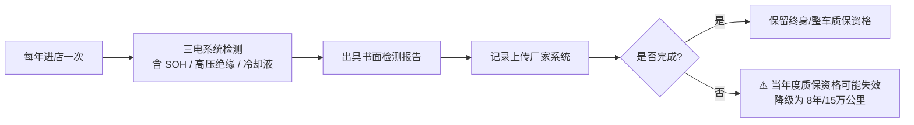

# 理想 / 蔚来 / 小鹏 / 零跑 等新势力 Neo-EV

> 本文档为 car-maintenance-advisor skill 的品牌分项参考，数据来自公开车主手册摘要与行业共识，最后更新 2026-08

## 品牌保养规格总览

> 理想（Li Auto，增程为主）、蔚来（NIO，换电+纯电）、小鹏（Xpeng，纯电+智驾）、零跑（Leapmotor，纯电+增程）四家新势力保养体系高度相似：以「三电检测 + 易损件」为核心，无传统机油机滤。下表以「增程（理想/零跑增程款）」与「纯电（蔚来/小鹏/零跑纯电）」对照。

| 项目 | 增程（理想 L 系列 / 零跑增程） | 纯电（蔚来 / 小鹏 / 零跑纯电） |
|------|-------------------------------|-------------------------------|
| 机油 + 机滤（增程器） | 10,000 km 或 12 月 | — |
| 空气滤芯 | 20,000 km 或 12 月 | 20,000 km 或 12 月 |
| 空调滤芯 | 20,000 km 或 12 月 | 20,000 km 或 12 月 |
| 火花塞（增程器） | 视手册 40,000–60,000 km | 不适用 |
| 减速箱油 | 40,000 km | 40,000 km |
| 刹车油 | 2 年 或 40,000 km | 2 年 或 40,000 km |
| 冷却液（增程器） | 视手册，一般 60,000 km 或 4 年 | — |
| 冷却液（电池/电机） | 视手册，一般 2 年 / 40,000 km | 2 年 / 40,000 km |
| 空调冷媒 | 2 年检查 | 2 年检查 |
| 轮胎换位 | 每 20,000 km | ⚠️ 电车扭矩大且车重，建议每 10,000 km 换位 |
| 电池健康检测（SOH） | 每 12 个月进店 | 每 12 个月进店 |
| 12V 蓄电池 | 2 年检查 | 2 年检查 |
| 高压线束绝缘检测 | 每 12 个月 | 每 12 个月 |
| 智驾传感器校准 | 视 OTA / 维修后 | 视 OTA / 维修后 |

> ⚠️ **新势力特别提醒：** 四家普遍要求「首任车主终身质保 / 整车质保」绑定「每年至少进店检测一次」。蔚来另需关注换电权益与 BaaS 电池租赁合约；理想需关注增程器保养；小鹏需关注智驾硬件 OTA 兼容；零跑条款相对简单但网点少。

## 机油与油液规格

| 油液类型 | 厂方规格要求 | 推荐粘度 | 备注 |
|---------|-------------|---------|------|
| 机油（理想增程器） | 理想自有规格，兼容 API SP | 5W-30 / 0W-20 | 增程器高频启停，建议全合成 |
| 机油（零跑增程器） | 零跑自有规格 | 5W-30 | 同上 |
| 刹车油 | DOT 4 | — | ⚠️ 不可用 DOT 5（硅油类） |
| 冷却液（增程器） | 各厂专用乙二醇型 | — | 免混，补液同色同型号 |
| 冷却液（电池） | 各厂低电导率电池冷却液 | — | ⚠️ 不可用发动机防冻液代替 |
| 减速箱油 | 各厂电驱专用减速箱油 | — | 40,000 km 更换；与变速箱油不通用 |
| 空调冷媒 | R134a / R1234yf（视车型） | — | 需认证技师操作 |
| 制动液含水率 | < 3% 为安全 | — | 检测笔可自测 |

> 📌 各厂油液型号差异较大，**补液或更换前务必核对车主手册指定型号**，不可跨品牌混用。

## 常见通病速查

| 高发问题 | 早期征兆 | 级别 | 是否延保 / 召回 |
|---------|---------|------|----------------|
| 蔚来 BMS SOC 估算偏差 | 电量显示与实际续航偏差 > 10%，换电后跳变 | 中 | 质保内免费刷写 BMS；个别批次换电需校准 |
| 蔚来换电站识别失败 | 换电时电池锁止超时或报错 | 中 | 多为锁体 / 换电口硬件问题，质保内更换 |
| 理想增程器机油乳化 | 机油盖内侧乳白色泡沫，短途低温多发 | 中 | 部分批次延长增程器质保；升级暖机策略 |
| 理想 L 系列空气悬挂漏气 | 车身一侧长时间下沉，气泵频繁启动 | 中 | 质保内更换气包；个别批次召回 |
| 小鹏智驾误触发 / 退坡 | 辅助驾驶无故退出，或紧急制动误触发 | 中 | 多为传感器标定 / OTA 问题，回店校准 |
| 小鹏 800V 平台充电跳枪 | 超充中途停止，或限功率 | 中 | 充口温控或 BMS 策略，刷写升级 |
| 零跑车机卡顿 / 黑屏 | 中控无响应，重启可恢复 | 低 | 多为软件问题，OTA 推送修复 |
| 零跑 SOH 快速下降 | 年度检测显示容量保持率异常走低 | 中 | 排查充电习惯与高温暴露；达阈值可索赔 |
| 通用：12V 蓄电池早衰 | 远程启动失败、中控黑屏重启 | 低 | 各厂陆续升级 DC-DC 管理策略 |

> 🔧 **通病处理原则：** 新势力车型高度依赖 OTA 与软件策略。遇到 SOC 偏差、充电跳枪、智驾异常等问题，**先查是否有对应 OTA / 固件版本**，再到授权店刷写，多数可免换件解决。

## 4S 常过度推销项

> 新势力多采用直营模式，无传统 4S 店；下表为「自营或合作服务店」常过度推荐项。

| 推销项 | 是否必要 | 建议间隔 | 自检法 |
|--------|---------|---------|--------|
| 空调管路「杀菌除味」套餐 | ⚠️ 部分必要 | 2 年或异味出现时 | 闻空调出风口；有霉味再处理 |
| 刹车深度保养（拆刹分泵润滑） | ❌ 常规不必 | — | 刹车无异响、不跑偏即可；雨季地区 2 年一次尚可 |
| 电池冷却液「升级」更换 | ⚠️ 按手册 | 2 年 / 40,000 km | 查冷却液冰点与电导率 |
| 「三电深度检测」加价包 | ❌ 常规 SOH 检测已足够 | — | 要求出具标准 SOH 报告即可 |
| 轮胎「氮气填充」 | ❌ 不必要 | — | 普通压缩空气足够 |
| 玻璃水 / 空调滤芯加价换 | ⚠️ 比外面贵 | 按手册 | 空调滤芯可自行更换 |
| 智驾硬件「升级校准」加价 | ❌ 售后校准应免费 | — | 维修或 OTA 后校准属质保范围 |
| 增程器「内部清洗」套餐（理想/零跑） | ❌ 一般不必要 | — | 机油无乳化即无需 |

## 新能源专属

> ⚠️ 新势力三电（电池、电机、电控）质保条款为本类文档重点。四家条款差异较大，以下为行业通行共识，**实际以购车合同及《三电质保条款》书面文本为准**。

### 三电质保条款细则（按品牌）

| 品牌 | 核心承诺 | 跟车还是跟人 | 终身质保前提 | 降级规则 |
|------|---------|-------------|-------------|---------|
| 理想 | 首任非营运车主三电终身质保 | **跟车不跟人**：过户后 8 年 / 15 万公里 | 首任 + 非营运 + 年度进店检测 + 单年里程不超标 + 无重大事故 | 任一不满足降级为 8 年 / 15 万公里 |
| 蔚来 | 首任车主三电终身质保（含换电车型） | **跟车不跟人**：过户后 8 年 / 15 万公里；换电权益另算 | 首任 + 非营运 + 年度进店检测 + 无重大事故 | 过户后换电权益可能调整，需确认 |
| 小鹏 | 首任车主三电终身质保（部分车型） | **跟车不跟人**：过户后 8 年 / 15 万公里 | 首任 + 非营运 + 年度进店检测 + 单年里程不超标 + 无重大事故 | 任一不满足降级为 8 年 / 15 万公里 |
| 零跑 | 首任车主三电质保（多为 8 年 / 15 万公里） | **跟车不跟人** | 首任 + 非营运 + 年度进店检测 | 条款相对简单，以购车合同为准 |

> 📌 **关键差异：** 蔚来因换电体系，电池「所有权」可能属于蔚来（BaaS 电池租赁模式）或属于车主（买断模式）。BaaS 模式下电池质保由蔚来承担，车主按月付租赁费；买断模式下按上述条款执行。

### SOH 检测与电池衰减索赔

| 项目 | 说明 |
|------|------|
| SOH 检测间隔 | 每 12 个月进店一次，与年度保养同步 |
| SOH 解读 | SOH ≥ 90% 健康；80–90% 注意；< 80% 一般达到衰减索赔阈值 |
| 衰减索赔边界 | 质保期内电池容量衰减 ≥ 20%（部分条款为 30%）可申请免费更换或均衡维修 |
| 索赔前提 | 完整年度检测记录 + 授权店保养记录 + 无违规拆装 |
| 检测报告 | 务必索要书面 SOH 报告（含电芯单体电压、内阻、容量保持率） |
| 蔚来换电特殊 | 换电模式下电池循环使用，SOH 由换电站自动检测，车主可在 App 查询 |

### BMS 固件升级

- 新势力车型高度依赖 OTA，BMS / MCU 固件更新频繁。
- 升级一般在授权店保养时同步刷写，**免费**；部分可通过远程 OTA 完成。
- 若遇到 SOC 跳变、充电跳枪、换电识别失败等问题，**主动询问是否有新版固件或 OTA 推送**。

### 自营桩权益过户规则（按品牌）

| 品牌 | 自营桩权益 | 过户规则 |
|------|-----------|---------|
| 理想 | 家充桩安装权益 | 跟车不跟人，安装名额随车过户给新车主 |
| 蔚来 | 换电权益 / 家充桩 | ⚠️ **换电权益跟人不跟车**：首任车主换电权益过户后失效；家充桩跟车 |
| 小鹏 | 家充桩安装权益 | 跟车不跟人，随车过户 |
| 零跑 | 家充桩安装权益 | 跟车不跟人，随车过户 |
| 通用 | 充电账户余额 | 跟账户，不随车；过户前建议结算 |
| 通用 | 自营超充 / 充电折扣 | 若有首任车主专属充电折扣，过户后通常失效 |

> 📌 **蔚来换电权益特别提醒：** 蔚来换电权益（如每月免费换电次数）通常「跟人不跟车」，即权益绑定车主账户而非车辆。过户后新车主需重新购买换电套餐或确认权益转移规则。BaaS 电池租赁合约则「跟车」，过户时须一并转移。

### 年度进店检测要求

> 📌 **关键提醒：** 年度检测的「年度」通常以购车开票日为起点计算，**不要跨年漏检**。部分车主因未按时进店导致终身质保被降级，事后补救极为困难。

## 旁路自保 Tips

1. **新势力质保跟车不跟人**：理想 / 蔚来 / 小鹏 / 零跑的终身质保均限首任非营运车主，二手车买家用 8 年 / 15 万公里。购车合同务必写明三电条款，保留首任车主过户凭证。
2. **蔚来换电权益跟人不跟车**：蔚来换电权益（如每月免费换电次数）通常绑定车主账户而非车辆。过户后新车主需重新购买换电套餐或确认权益转移规则。BaaS 电池租赁合约则「跟车」，过户时须一并转移。
3. **年度检测别跨年**：以开票日为周期，每年至少进店做一次三电检测并索要书面 SOH 报告。漏检一年可能直接降级终身质保。
4. **OTA 记录要留底**：每次 OTA 升级前后记录版本号与变化，遇到智驾异常、SOC 跳变等问题时可凭记录申请回滚或索赔。
5. **衰减索赔留证据**：每次 SOH 检测报告存档，若 SOH 持续下降至 80% 以下，凭连续记录申请衰减索赔成功率更高。蔚来换电车主可在 App 查询每次换电的电池 SOH 数据。
